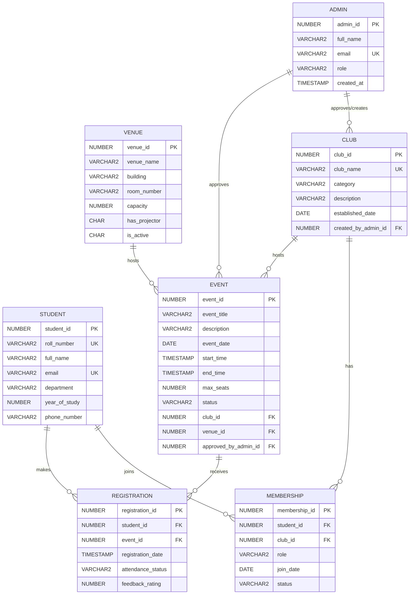

# Campus Event & Club Management System - ER Diagram

You can copy the code block below and paste it into [Mermaid Live Editor](https://mermaid.live/) to generate a high-quality visualization for your project report screenshot.

